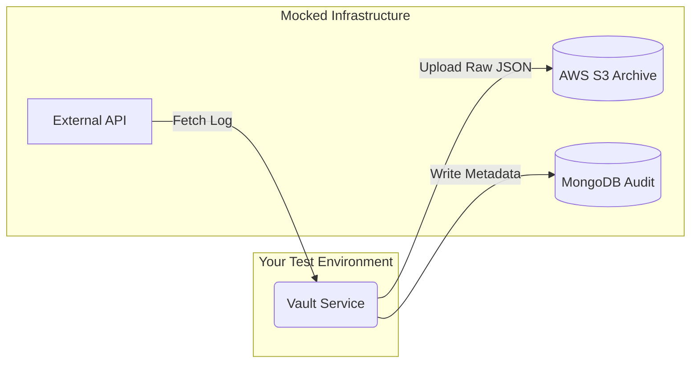

# Automation Tech Lead – Home Assignment  
## End-to-End Test Framework for Data Pipeline Integrity

---

## Objective

Design and implement a **production-grade automation test framework** validating an end-to-end data pipeline.

**Definition of Done:**  
You submit a GitHub repository containing a runnable automation project with:
- Clear execution instructions
- Explicitly defined test scope
- Fully automated end-to-end tests

---

## System Under Test (SUT)

**Audit Vault Service**

A service responsible for:
1. Fetching security log entries from an external REST API  
2. Archiving raw log payloads into **AWS S3**  
3. Writing audit metadata into **MongoDB**

---

## Data Flow

1. **Extract** – Fetch log data from REST API  
2. **Load (S3)** – Store raw JSON payload in S3  
3. **Audit (DB)** – Persist metadata record in MongoDB  
   - S3 object key  
   - Timestamp  
   - Status  

---

## Technical Constraints

You must use the following stack:

| Area | Requirement |
|----|----|
| Language | Python 3.9+ |
| Test Framework | `pytest` |
| AWS Mocking | `moto` (S3) |
| MongoDB Mocking | `mongomock` |
| API Mocking | `responses` **or** `respx` |
| Execution | Docker |

No external cloud resources may be used.

---


---

## Assignment Requirements

### 1. Framework Architecture (Tech Lead Level)

Design for extensibility and testability.

**Mandatory:**
- Dependency Injection via constructors
- No hard-coded clients
- Clear separation of concerns

**Expected Structure:**
- `VaultService` orchestrator
- Abstract interfaces for:
  - Object storage
  - Database access
  - API client
- Concrete implementations wired via fixtures

---

### 2. Pytest Design & Isolation

Demonstrate advanced pytest usage.

**Requirements:**
- Centralized fixture management in `conftest.py`
- Full isolation per test:
  - Empty S3 bucket
  - Empty MongoDB collection
- Use `yield` fixtures for setup/teardown
- Thoughtful fixture scoping (`session` vs `function`)

---

### 3. End-to-End Test Scenarios

Implement tests validating real execution flow.

#### Scenario 1 – Happy Path
- API returns valid payload
- Payload uploaded to S3
- Metadata recorded in MongoDB
- Assertions validate:
  - S3 object existence
  - MongoDB record correctness

#### Scenario 2 – Storage Failure
- Simulate S3 `403 Forbidden`
- Verify:
  - No MongoDB audit record is written
  - Failure is handled deterministically

#### Scenario 3 – API Resilience
- First API call returns `503 Service Unavailable`
- Second attempt succeeds
- Implement retry logic
- Assert successful pipeline completion

---

## Docker Execution (Mandatory)

Your test suite must run **only** via Docker.
YOU MAY USE the `.dockerignore`, `.Dockerfile` and `requirements.txt` from this repo

```bash
docker build -t vault-automation-test .
docker run --rm vault-automation-test
```

## Definition of Done (DoD)

Your submission is considered complete when:

- Repository is forked and pushed to your GitHub account
- Tests run successfully using Docker only
- README includes:
  - How to run the tests
  - What is being tested
  - 2–3 paragraphs explaining:
    - Dependency Injection decisions
    - Test isolation strategy
- Code quality:
  - PEP8 compliant
  - Clear naming
  - Deterministic tests


### Evaluation Focus
  - Architectural clarity
  - Test reliability
  - Isolation correctness
  - Failure handling
  - Code readability
  - Leadership-level design decisions

## Deliverable:
A GitHub repository link containing the completed automation project.
