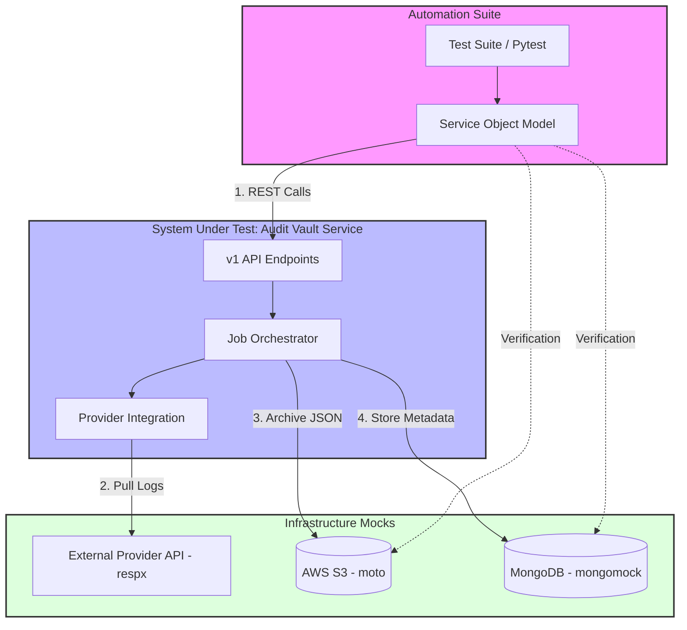

# 🚀 Automation Tech Lead: Data Pipeline Integrity Project

## 1. Project Objective

You are tasked with building a production-grade automation framework for the **Audit Vault Service (SUT)**. The service is already built and running; your goal is to validate the reliability, data integrity, and error-handling of the pipeline that moves data from external providers into secure storage.

This assignment evaluates your ability to:

* **Architect** a scalable test framework (Service Object Model).
* You may use mocks to orchestrate S3, MongoDB, REST APIs.
* **Validate** data at rest (deep-diffing raw logs).
* **Apply** engineering judgment when using AI tools.

---

## 2. API Specifications (The SUT)

### System Overview

The **Audit Vault System** is a high-volume, asynchronous data pipeline designed to collect audit logs from external providers and persist them into immutable storage.

### Core Objectives for Candidates

| Objective | Description |
|---------|-------------|
| Data Fidelity | Ensure zero mutation from source to storage. |
| Integrity | Verify end-to-end integrity using cryptographic checksums. |
| Resilience | Validate behavior under partial infrastructure failures (e.g., S3/DB brownouts). |

---

## 2. Architecture & API Mapping

The system is divided into two logical planes:

- **Control Plane**: Manages orchestration and job lifecycle.
- **Data Plane**: Manages raw payload storage and retrieval.

| Logical Layer | Responsibility | Associated API Endpoint |
|--------------|----------------|--------------------------|
| Ingestion | Accepts requests and enqueues jobs. | `POST /v1/ingest` |
| Orchestration | Manages job states: `pending` → `processing` → `completed`. | `GET /v1/jobs/{job_id}` |
| Provider | Validates credentials and pulls raw data. | `POST /v1/providers/validate` |
| Persistence | Stores raw data in **S3** and metadata in **MongoDB**. | Internal storage operations |
| Retrieval | Fetches logs and validates SHA-256 checksums. | `GET /v1/logs`, `GET /v1/logs/{id}/raw` |

---

## 3. Data Integrity & Operational Contract

The automation framework may (feel free to test whatever suits you) validate the following system guarantees:

| Feature | System Contract | Testing Requirement |
|--------|-----------------|---------------------|
| Immutability | Raw audit data is never transformed after ingestion. | Perform a structural deep-diff between source and S3. |
| Verification | A SHA-256 checksum is generated on write. | Match the `X-Vault-Checksum` header against the raw body. |
| Asynchronicity | Ingestion is non-blocking; job state is polled. | Implement polling with timeouts and failure handling. |
| Idempotency | Duplicate ingestion requests do not create redundant data. | Verify repeated calls do not corrupt or duplicate archives. |
| Resilience | Partial infra failures are handled gracefully. | Mock infra failures and validate retry behavior. |

#### Operational Characteristics

- Fully asynchronous execution.
- Idempotent ingestion behavior.
- Retry-aware infrastructure interactions.
- Explicit separation between control plane (jobs, metadata) and data plane (raw payloads).

This system description defines the behavioral contract that the automation framework must validate before interacting with the public APIs below.

The service is available at `http://localhost:8080`. Your framework must interact with **five** endpoints.


## API Specification Summary

### Control Plane APIs

| Method | Endpoint | Description |
|-------|----------|-------------|
| POST | `/v1/ingest` | Triggers a new ingestion job. Returns `job_id` and `estimated_completion_ms`. |
| GET | `/v1/jobs/{job_id}` | Returns job state (`pending`, `processing`, `completed`, `failed`) and `s3_path`. |
| POST | `/v1/providers/validate` | Performs connectivity and credential validation for providers. |

### Data Plane APIs

| Method | Endpoint | Description |
|-------|----------|-------------|
| GET | `/v1/logs` | Paginated metadata search including log IDs and checksums. |
| GET | `/v1/logs/{log_id}/raw` | Streams the original JSON payload with `X-Vault-Checksum` header. |


### 📡 1. Trigger Data Ingestion

**Endpoint**: `POST /v1/ingest`

**Request**:

```json
{
  "provider_id": "aws_cloudtrail",
  "range": { "start": "2026-01-01T00:00:00Z", "end": "2026-01-02T00:00:00Z" },
  "priority": "high"
}
```

**Response** (202 Accepted):

```json
{ "job_id": "job_99b7", "status": "queued", "estimated_completion_ms": 5000 }
```

---

### 📊 2. Job Status Polling

**Endpoint**: `GET /v1/jobs/{job_id}`

**Response** (200 OK):

```json
{
  "job_id": "job_99b7",
  "state": "completed",
  "metrics": { "records_synced": 150, "bytes_written": 102400 },
  "artifacts": { "s3_path": "s3://vault/2026/01/01/logs.json" }
}
```

Valid states: `pending`, `processing`, `completed`, `failed`.

---

### 🔍 3. Audit Metadata Search

**Endpoint**: `GET /v1/logs?limit=50&offset=0`

**Response** (200 OK):

```json
{
  "data": [
    { "id": "log_1", "checksum": "sha256:e3b0c...", "timestamp": "2026-01-01T12:00:00Z" }
  ],
  "meta": { "total_count": 150, "has_more": true }
}
```

---

### 📥 4. Raw Content Retrieval

**Endpoint**: `GET /v1/logs/{log_id}/raw`

**Response** (200 OK):

* Streams the raw JSON content exactly as stored in S3.
* Includes header `X-Vault-Checksum` for integrity verification.

---

### 🔌 5. Provider Connection Test

**Endpoint**: `POST /v1/providers/validate`

**Request**:

```json
{ "provider_type": "rest", "api_key": "secret_token" }
```

**Responses**:

* 200 OK: `{ "connection": "secure", "latency_ms": 45 }`
* 401 Unauthorized: `{ "error": "Invalid Provider Credentials" }`

---

## 3. High-Value Test Scenarios

### 💎 Scenario 1: Log Fidelity Test (Data Integrity)

Objective: prove the service does not mutate or corrupt data in transit.

Steps:

1. **Setup**: Mock the external provider to return JSON containing edge cases:

   * Unicode characters
   * Large integers
   * Nested objects with null values
2. **Execution**: Trigger `/v1/ingest` and poll job status until `completed`.
3. **Validation**:

   * Fetch raw content via `/v1/logs/{log_id}/raw`.
   * Perform a deep structural diff between mocked input and stored output.
4. **Side-Effect Validation**:

   * Verify MongoDB metadata checksum equals SHA256 of the S3 object.

---

### 🚧 Scenario 2: Infrastructure Brownout

Objective: validate resilience under partial infrastructure failure.

Steps:

1. **Setup**: Mock S3 to return `503 SlowDown` for the first two upload attempts, then succeed.
2. **Execution**: Trigger ingestion.
3. **Validation**:

   * Assert retry strategy is applied.
   * Job completes successfully without manual retry.

---

### 💡 Scenario 3: Creative Challenge

Design and implement **one** test that exposes a race condition or consistency flaw.

Example:

* A log record exists in MongoDB.
* The corresponding S3 object is manually deleted.
* A client requests `/v1/logs/{log_id}/raw`.

Define the expected system behavior and assert it.

---

## 4. Submission Requirements
1. your python automation project

2. **README.md**

   * High-level explanation of the test architecture and dependency injection strategy.
   * Description of how mocks are wired and isolated per test.

2. **Docker**

   * You can use the example docker file in the repo to create one for us to run your automation `docker build -t vault-test . && docker run --rm vault-test`. We are aware course the tests will fail :-)

---

**Optional**: A starter `pytest` example for the Log Fidelity deep-diff test may be included, but architectural decisions, correctness, and data integrity validation carry the highest weight.
