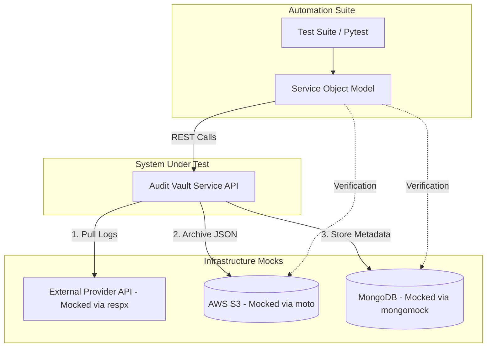

# 🚀 Automation Tech Lead: Data Pipeline Integrity Project

## 1. Project Objective

You are tasked with building a production-grade automation framework for the **Audit Vault Service (SUT)**. The service is already built and running; your goal is to validate the reliability, data integrity, and error-handling of the pipeline that moves data from external providers into secure storage.

This assignment evaluates your ability to:

* **Architect** a scalable test framework (Service Object Model).
* **Orchestrate** complex mocks (S3, MongoDB, REST APIs).
* **Validate** data at rest (deep-diffing raw logs).
* **Apply** engineering judgment when using AI tools.

---

## 2. API Specifications (The SUT)

### System Overview

The **Audit Vault System** is a data-ingestion and audit-storage pipeline designed to reliably collect, validate, and persist audit logs from external providers into immutable, queryable storage.

The system operates asynchronously and is optimized for high-volume, append-only workloads where **data fidelity, ordering, and integrity** are critical.

#### Core Responsibilities

- **Ingest** audit data from external providers on demand.
- **Process** ingestion jobs asynchronously with backpressure and retry handling.
- **Persist** raw, unmodified log payloads in object storage.
- **Index** and store log metadata for search and retrieval.
- **Guarantee** end-to-end data integrity via cryptographic checksums.
- **Expose** deterministic APIs for audit verification and compliance workflows.

#### Logical Architecture

The system is composed of five logical layers:

1. **Ingestion API Layer**  
   Accepts ingestion requests, validates provider configuration, and enqueues jobs for processing.

2. **Job Orchestration Layer**  
   Manages asynchronous job state transitions (`pending → processing → completed | failed`), retry strategies, and failure recovery.

3. **Provider Integration Layer**  
   Pulls raw audit data from external providers and normalizes transport without mutating content.

4. **Persistence Layer**  
   - **Object Storage (S3)**: Stores raw audit payloads exactly as received.  
   - **Metadata Store (MongoDB)**: Stores log identifiers, timestamps, checksums, and object references.

5. **Retrieval & Verification Layer**  
   Enables search, raw log retrieval, and checksum-based integrity validation for consumers and auditors.

#### Data Integrity Model

- Raw audit data is **never transformed** after ingestion.
- A **SHA-256 checksum** is calculated on write and stored alongside metadata.
- Retrieval APIs expose both the raw payload and its checksum, enabling independent verification.
- Metadata and raw storage are intentionally decoupled, allowing consistency and failure scenarios to be observable and testable.

#### Operational Characteristics

- Fully asynchronous execution.
- Idempotent ingestion behavior.
- Retry-aware infrastructure interactions.
- Explicit separation between control plane (jobs, metadata) and data plane (raw payloads).

This system description defines the behavioral contract that the automation framework must validate before interacting with the public APIs below.

The service is available at `http://localhost:8080`. Your framework must interact with **five** endpoints.




### 📡 1. Trigger Data Ingestion

**Endpoint**: `POST /v1/ingest`

**Request**:

```json
{
  "provider_id": "aws_cloudtrail",
  "range": { "start": "2026-01-01T00:00:00Z", "end": "2026-01-02T00:00:00Z" },
  "priority": "high"
}
```

**Response** (202 Accepted):

```json
{ "job_id": "job_99b7", "status": "queued", "estimated_completion_ms": 5000 }
```

---

### 📊 2. Job Status Polling

**Endpoint**: `GET /v1/jobs/{job_id}`

**Response** (200 OK):

```json
{
  "job_id": "job_99b7",
  "state": "completed",
  "metrics": { "records_synced": 150, "bytes_written": 102400 },
  "artifacts": { "s3_path": "s3://vault/2026/01/01/logs.json" }
}
```

Valid states: `pending`, `processing`, `completed`, `failed`.

---

### 🔍 3. Audit Metadata Search

**Endpoint**: `GET /v1/logs?limit=50&offset=0`

**Response** (200 OK):

```json
{
  "data": [
    { "id": "log_1", "checksum": "sha256:e3b0c...", "timestamp": "2026-01-01T12:00:00Z" }
  ],
  "meta": { "total_count": 150, "has_more": true }
}
```

---

### 📥 4. Raw Content Retrieval

**Endpoint**: `GET /v1/logs/{log_id}/raw`

**Response** (200 OK):

* Streams the raw JSON content exactly as stored in S3.
* Includes header `X-Vault-Checksum` for integrity verification.

---

### 🔌 5. Provider Connection Test

**Endpoint**: `POST /v1/providers/validate`

**Request**:

```json
{ "provider_type": "rest", "api_key": "secret_token" }
```

**Responses**:

* 200 OK: `{ "connection": "secure", "latency_ms": 45 }`
* 401 Unauthorized: `{ "error": "Invalid Provider Credentials" }`

---

## 3. High-Value Test Scenarios

### 💎 Scenario 1: Log Fidelity Test (Data Integrity)

Objective: prove the service does not mutate or corrupt data in transit.

Steps:

1. **Setup**: Mock the external provider to return JSON containing edge cases:

   * Unicode characters
   * Large integers
   * Nested objects with null values
2. **Execution**: Trigger `/v1/ingest` and poll job status until `completed`.
3. **Validation**:

   * Fetch raw content via `/v1/logs/{log_id}/raw`.
   * Perform a deep structural diff between mocked input and stored output.
4. **Side-Effect Validation**:

   * Verify MongoDB metadata checksum equals SHA256 of the S3 object.

---

### 🚧 Scenario 2: Infrastructure Brownout

Objective: validate resilience under partial infrastructure failure.

Steps:

1. **Setup**: Mock S3 to return `503 SlowDown` for the first two upload attempts, then succeed.
2. **Execution**: Trigger ingestion.
3. **Validation**:

   * Assert retry strategy is applied.
   * Job completes successfully without manual retry.

---

### 💡 Scenario 3: Creative Challenge

Design and implement **one** test that exposes a race condition or consistency flaw.

Example:

* A log record exists in MongoDB.
* The corresponding S3 object is manually deleted.
* A client requests `/v1/logs/{log_id}/raw`.

Define the expected system behavior and assert it.

---

## 4. Submission Requirements
1. your python automation project

2. **README.md**

   * High-level explanation of the test architecture and dependency injection strategy.
   * Description of how mocks are wired and isolated per test.

2. **Docker**

   * You can use the example docker file in the repo to create one for us to run your automation `docker build -t vault-test . && docker run --rm vault-test`. We are aware course the tests will fail :-)

---

**Optional**: A starter `pytest` example for the Log Fidelity deep-diff test may be included, but architectural decisions, correctness, and data integrity validation carry the highest weight.
