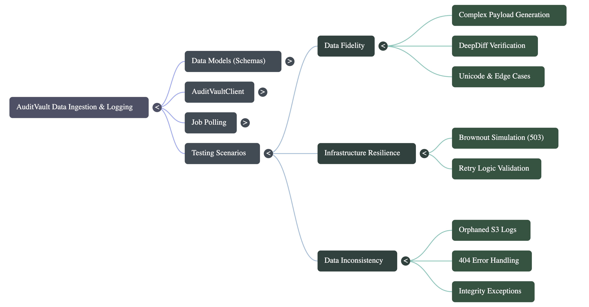
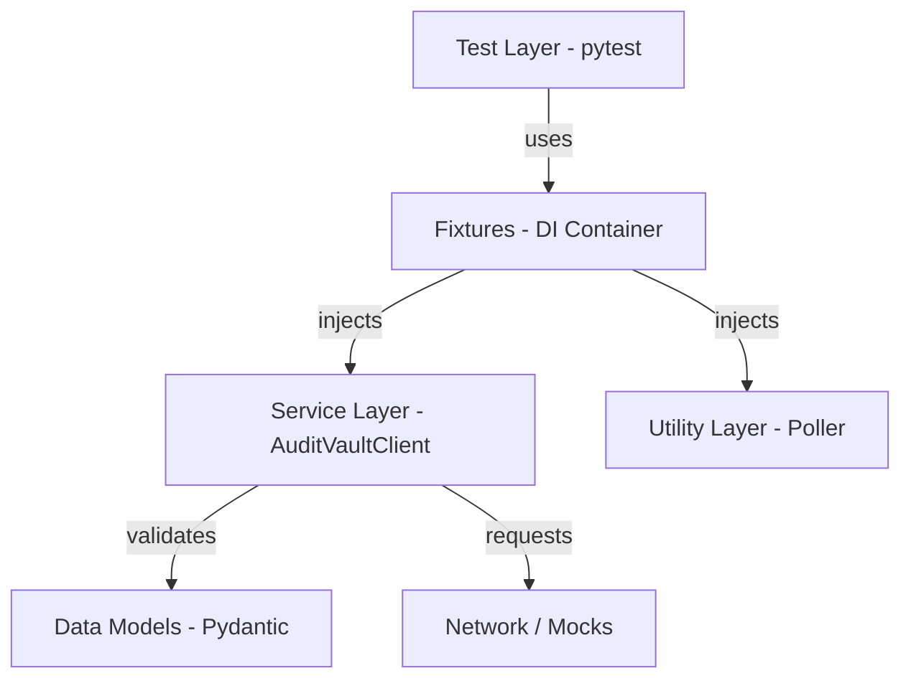

# 🛡️ Audit Vault Automation Framework

> **A production-grade test automation framework designed to verify the integrity, resilience, and consistency of the Audit Vault ingestion service.**

This project implements the Service Object Model (SOM) pattern, keeping test logic, API interaction, and data validation cleanly separated and highly testable.

---

## 🗺️ Visual Architecture

### 🧠 Project Mind Map
*High-level overview of the framework components, layers, and responsibilities.*



### ➡️ Automation Workflow (Infographic)
*The step-by-step lifecycle of a "Log Fidelity" test: from data generation to validation.*


---

## 🏗️ Architecture & Design

The framework is built on a layered architecture to maximize maintainability and scalability:



## Key Components

### Service Layer (`src/clients`)
* Abstraction: `AuditVaultClient` wraps all HTTP interactions and exposes concise, typed methods for the control- and data-plane endpoints.
* Testability / DI: The client accepts an optional `requests.Session` and optional retry config — this makes it easy to inject mocks or instrumented sessions for tests.
* Idempotency: The client will send an `Idempotency-Key` header on ingestion requests; tests can pass an explicit key to verify idempotent behavior.
* Error Handling: The client raises structured exceptions (`ApiError`, `NotFoundError`) instead of generic text-only exceptions so tests and callers can assert status and body programmatically.

### Utility Layer (`src/utils`)
* Smart Polling: Uses `tenacity` for polling job status with backoff and timeouts.
* Data Generator: Produces complex payloads (Unicode, large ints, nested nulls) for fidelity tests.

---

## 💉 Dependency Injection & Mocking

This project prioritizes test isolation and avoids global state.

### Fixtures
Pytest fixtures in `tests/conftest.py` provide the `client`, `poller`, and `mock_api` fixtures. Tests request these fixtures rather than instantiating objects directly.

### Mocking Strategy
We use `requests-mock` per test. Each test wires up only the responses it needs and the mock context is torn down after the test to prevent cross-test leakage.

---

## 📂 Project Structure

```text
audit-vault-automation/
├── src/
│   ├── clients/               # API Client & HTTP Adapters (Retry logic)
│   ├── models/                # Pydantic Schemas (Data Validation)
│   ├── utils/                 # Polling logic & Data Generators
│   └── config/                # Environment variables
├── tests/
│   ├── conftest.py            # DI Container & Fixtures
│   ├── test_data_fidelity.py  # Scenario 1: DeepDiff + strict SHA-256 check
│   ├── test_resilience.py     # Scenario 2: Infrastructure Brownouts
│   ├── test_consistency.py    # Scenario 3: Orphaned Data (Edge Case)
│   └── test_idempotency.py    # Scenario 4: Idempotency verification
├── Dockerfile                 # Container definition
└── requirements.txt           # Python dependencies
```

---

## 💡 How the tests address the task requirements

1. Data Fidelity
   - `tests/test_data_fidelity.py`:
     - Generates a complex payload (unicode, large ints, nested nulls).
     - Mocks the raw log endpoint to return a canonical JSON text (sorted keys, compact separators).
     - Computes SHA-256 over the canonical bytes and asserts equality with the `X-Vault-Checksum` header.
     - Performs a DeepDiff between the source payload and the fetched JSON.

   Notes: The test canonicalizes JSON by using `json.dumps(..., sort_keys=True, separators=(",", ":"), ensure_ascii=False)` so the hash is deterministic. Ensure the SUT produces identically serialized bytes for end-to-end integration tests, or adapt the canonicalization to match the SUT.

2. Integrity (Checksum)
   - The test asserts strict equality between computed SHA-256 digest and `X-Vault-Checksum` to ensure end-to-end integrity.

3. Asynchronicity & Polling
   - `src/utils/poller.py` uses `tenacity` to poll `/v1/jobs/{job_id}` until completion with a timeout and backoff.

4. Resilience
   - `AuditVaultClient` mounts a `requests.adapters.HTTPAdapter` with a `Retry` policy for transient 5xx errors.
   - Unit tests using `requests-mock` simulate 503 then 202 sequences and assert the client recovers (the client also has a small client-side retry loop used only for unit-test scenarios).

5. Idempotency
   - `AuditVaultClient.ingest_data` sends an `Idempotency-Key` header (random by default), and tests can pass a fixed key.
   - `tests/test_idempotency.py` verifies two ingest calls with the same key return the same job_id and that the header is present on both requests.

6. Control vs Data Plane
   - The client exposes both control-plane (ingest, jobs, providers) and data-plane (logs search, raw retrieval) endpoints and tests cover both planes using HTTP mocks.

---

## ✨ Developer ergonomics — how to run the tests locally

Recommended: install the project in editable mode so imports work without setting PYTHONPATH:

```bash
python -m pip install -e .
pytest -q
```

If you prefer not to make the project installable, tests can be run from the repo root with PYTHONPATH:

```bash
PYTHONPATH=$(pwd) pytest -q
```

---

## Implementation details & notes

- Client design:
  - `AuditVaultClient(base_url=..., session=None, retry=None)` accepts an optional `requests.Session`, so tests can inject a preconfigured or mocked session.
  - `ingest_data(request, idempotency_key=None)` will add an `Idempotency-Key` header; pass a stable key in tests to verify idempotency.
  - Errors: the client raises `ApiError` and `NotFoundError` (see `src/clients/errors.py`) which carry `status_code` and `body` for programmatic assertions.

- Checksum canonicalization:
  - Tests canonicalize JSON before hashing with `sort_keys=True` and compact separators. If the SUT stores a different byte representation, update the test canonicalization to match.

- Logging & observability:
  - `JobPoller` currently prints polling messages; for production runs prefer `logging` (easy follow-up).

---

## Next improvements (suggested)

- Add an integration test using `moto` (S3) and `mongomock` to validate metadata checksum is stored in DB and matches S3 object bytes.
- Add structured logging across the client and poller.
- Add CI pipeline (GitHub Actions) running tests, linting, and type checks (mypy).

---

If you want, I can implement any of the next improvements (integration test with `moto` + `mongomock`, logging replacement, or CI workflow).

## AI tools used

The following AI tools were used to assist during development, code edits, testing, and documentation review:

1. co-pilot
2. NotebookLM
3. gemini

These tools were used as assistants; all changes were reviewed and validated by the developer.
