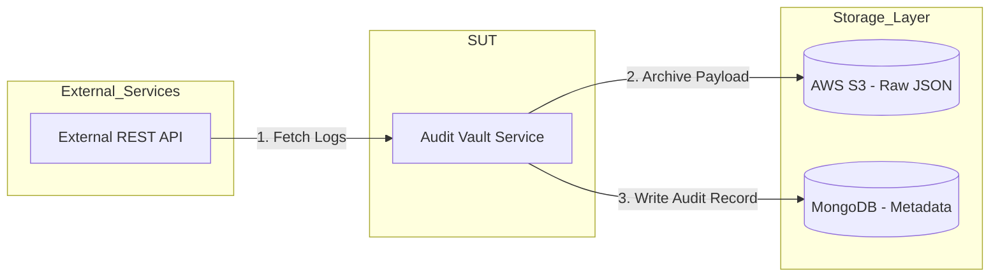

# 🚀 Automation Tech Lead: Data Pipeline Integrity Project

## 1. Project Objective

Design and implement a production-grade automation test project validating an end-to-end data pipeline. You are responsible for building both the **System Under Test (SUT)** and the **Automation Framework**.

This assignment evaluates:
- Architectural design for extensibility and test isolation.
- Mastery of pytest lifecycle, fixtures, and mocking strategies.
- Deterministic handling of failures across a multi-component pipeline.

The use of AI tools is **expected and encouraged**.  
However, evaluation focuses on your **engineering judgment**:
- Critical review of all AI-generated code.
- Explicit intervention where AI output is incorrect, incomplete, or suboptimal.
- Demonstrated understanding of automation architecture decisions and pytest strategies.

Your reasoning, corrections, and architectural choices must be documented in `AI_WORKFLOW.md`.

---

## 2. System Architecture & Data Flow

The following section describes the required interaction between the **Vault Service** (SUT) and the external components. Your implementation must respect these boundaries.

- An external REST API is queried to fetch audit logs.
- The Audit Vault Service processes the payload.
- Raw JSON payloads are archived to AWS S3.
- Metadata records are written to MongoDB.

### 🛠️ Mandatory Architectural Standards

* **Dependency Injection (DI)**: Use constructors to inject clients (S3, MongoDB, API); hard-coded clients are strictly prohibited.

* **Separation of Concerns**: Maintain a clear distinction between the service logic (the SUT) and the test suite logic.

---

## 3. Automation & Lifecycle Requirements

Your test suite must run using `pytest` and adhere to strict isolation standards.

### 🧹 Explicit Setup & Teardown

* **Centralized Fixtures**: All lifecycle management must reside in `tests/conftest.py`.

* **Yield Fixtures**: Demonstrate proper resource management using `yield` for setup and teardown.

* **Strict Isolation**: Every test must start with a **guaranteed empty** S3 bucket and **empty** MongoDB collection.

* **Mocking Stack**: You must use `moto` (S3), `mongomock` (MongoDB), and `respx` or `responses` (API). **No external cloud resources may be used**.

---

## 4. Test Scenarios (End-to-End)

Implement the following deterministic scenarios:

| Scenario | Input/Condition | Required Assertions |
| --- | --- | --- |
| **1. Happy Path** | API returns valid 200 payload. | Validate S3 object existence and MongoDB record correctness. |
| **2. Storage Failure** | Simulate S3 `403 Forbidden`. | Verify no MongoDB record is written and failure is handled deterministically. |
| **3. API Resilience** | First API call returns `503 Service Unavailable`; second call succeeds. | Implement **Retry Logic** and assert successful pipeline completion. |

---

## 5. Modern Workflow (AI Requirement)

The use of AI tools (ChatGPT, Claude, Copilot, etc.) is encouraged to accelerate development. However, as part of the "Definition of Done," you must submit an **`AI_WORKFLOW.md`** file containing:

* **Prompt Logs**: A list of the primary prompts used to generate the architecture or logic.
* **Engineering Oversight**: A section explaining where the AI provided an incorrect or "hallucinated" solution and how you refactored it to meet these project requirements.

---

## 6. Definition of Done (DoD)

Please send us link to a complete project ; The project is complete when:

1. **Repository**: Forked and pushed to your GitHub account. Should include the files, the AI_Prompts

2. **Execution**: The suite runs successfully via Docker: we will download your project and run: `docker build -t vault-test . && docker run --rm vault-test`.

3. **README**: Includes execution instructions and 2-3 paragraphs explaining your **Dependency Injection** and **Test Isolation** strategies, and what AI tools you have been using.

4. **Standards**: Code is PEP8 compliant with clear naming and deterministic results.
